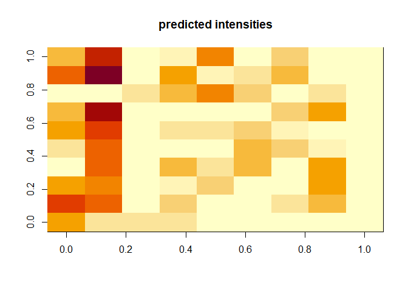

<!-- README.md is generated from README.Rmd. Please edit that file -->

# LightFitR

<!-- badges: start -->

<!-- badges: end -->

The goal of LightFitR is to allow scientists to program complex light
regimes with confidence.

Often, LED light fixtures are programmed with ‘intensity’ units, which
often does not scale linearly with the actual measured light output from
the light fixtures. Further, if using multiple wavelength channels,
there will often be bleedthrough between the channels, affecting the
quality and quantity of light received by your experimental subjects.
Our package takes calibration data and user-defined target irradiances
and it tells you what intensities to use in order to achieve those
irradiances.

## Installation

You can install the development version of LightFitR from
[GitHub](https://github.com/ginavong/LightFitR) with:

``` r
# install.packages("devtools")
devtools::install_github("ginavong/LightFitR")
```

## Example

This is a basic example which shows you how to solve a common problem:

``` r
library(LightFitR)

# Prep variables
calib <- LightFitR::calibration
times <- LightFitR::time_vector
target_irradiance <- LightFitR::target_irradiance

# Run function
makeRegime(times, target_irradiance, calib$led, calib$wavelength, calib$intensity, calib$irradiance)
#> Ranges fall within irradiances acheivable by heliospectra: TRUE
#> Warning in internal.closestWavelength(unique(calibration_df$wavelength), : We
#> couldn't find exact matches with the peak wavelengths specified. Returning the
#> closest wavelengths
#> Warning in internal.closestWavelength(unique(calib$wavelength), peaks): We
#> couldn't find exact matches with the peak wavelengths specified. Returning the
#> closest wavelengths
#> Ranges fall within irradiances acheivable by heliospectra: TRUE
```



    #>        00:00:00   00:05:00   00:10:00   00:15:00   00:20:00   00:25:00  
    #> time   "00:00:00" "00:05:00" "00:10:00" "00:15:00" "00:20:00" "00:25:00"
    #> hour   "0"        "0"        "0"        "0"        "0"        "0"       
    #> minute "0"        "5"        "10"       "15"       "20"       "25"      
    #> second "0"        "0"        "0"        "0"        "0"        "0"       
    #> 380nm  "963"      "1000"     "1000"     "74"       "474"      "1000"    
    #> 400nm  "517"      "1000"     "1000"     "1000"     "1000"     "1000"    
    #> 420nm  "385"      "0"        "0"        "0"        "0"        "160"     
    #> 450nm  "493"      "633"      "278"      "856"      "51"       "549"     
    #> 530nm  "62"       "86"       "671"      "485"      "22"       "484"     
    #> 620nm  "6"        "49"       "43"       "777"      "821"      "600"     
    #> 660nm  "48"       "499"      "98"       "176"      "601"      "292"     
    #> 735nm  "12"       "838"      "1000"     "1000"     "278"      "166"     
    #> 5700k  "0"        "0"        "0"        "0"        "0"        "0"       
    #>        00:30:00   00:35:00   00:40:00   00:45:00  
    #> time   "00:30:00" "00:35:00" "00:40:00" "00:45:00"
    #> hour   "0"        "0"        "0"        "0"       
    #> minute "30"       "35"       "40"       "45"      
    #> second "0"        "0"        "0"        "0"       
    #> 380nm  "817"      "50"       "1000"     "934"     
    #> 400nm  "1000"     "54"       "1000"     "1000"    
    #> 420nm  "0"        "525"      "0"        "0"       
    #> 450nm  "0"        "779"      "1000"     "261"     
    #> 530nm  "61"       "1000"     "201"      "1000"    
    #> 620nm  "0"        "629"      "527"      "9"       
    #> 660nm  "710"      "34"       "886"      "627"     
    #> 735nm  "1000"     "390"      "177"      "0"       
    #> 5700k  "0"        "0"        "0"        "0"

# Devnotes

You’ll still need to render `README.Rmd` regularly, to keep `README.md`
up-to-date. `devtools::build_readme()` is handy for this.

You can also embed plots, for example:

In that case, don’t forget to commit and push the resulting figure
files, so they display on GitHub and CRAN.
